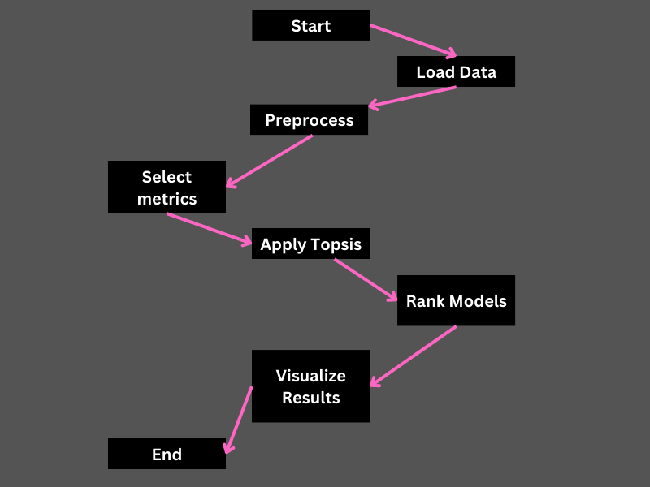
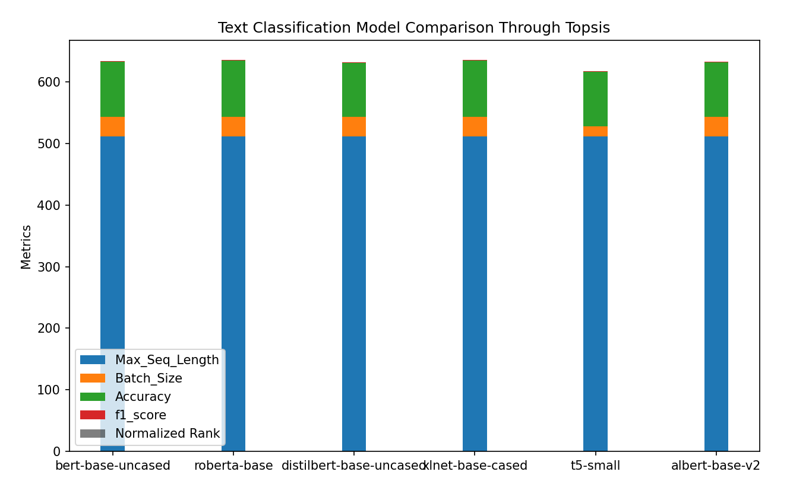

# Text Classification Model Comparison Project (using topsis)

## Overview

Text Classification is the task of assigning a label or class to a given text. The goal is to teach a machine learning model to recognize patterns in the text and assign it to the appropriate category based on the training it receives from labeled examples. Some use cases are sentiment analysis, natural language inference, and assessing grammatical correctness.

## Key Features:

1. **Metrics Considered:**

   - The comparison is based on essential metrics, including Accuracy,F1_Score,Batch_Size,  Max_Seq_Length. 

2. **Methodology - TOPSIS:**

   - The Technique for Order of Preference by Similarity to Ideal Solution (TOPSIS) method is employed for the comparison. This method considers both the similarity to the ideal solution and the dissimilarity to the negative ideal solution, providing a comprehensive ranking.

3. **Models Evaluated:**
   - Real-world pretrained models, such as bert-base-uncased, roberta_base, distilbert-base-uncased,xlnet-base-cased, t5-small, and albert-base-v2, are included in the comparison. These models are widely used in text classification tasks.

## Project Structure:

- **`data.csv`**: CSV file containing evaluation metrics for each model.
- **`result.csv`**: CSV file with ranked results in tabular format and data used for creating a bar chart.
- **`BarChart.png`**: Bar chart visualizing the model comparison.

## How to Run:

## Results and Analysis:

1. **Ranked Table:**

- Explore detailed ranked results in classification_table_result.csv:

| Model                  | Max_Seq_Length | Batch_Size | Accuracy | F1_Score | TOPSIS_Score         | Rank |
|------------------------|----------------|------------|----------|----------|----------------------|------|
| bert-base-uncased      | 512            | 32         | 89.5     | 0.895    | 0.9660787739202867   | 3.0  |
| roberta-base           | 512            | 32         | 91.2     | 0.912    | 1.0                  | 1.0  |
| distilbert-base-uncased| 512            | 32         | 87.3     | 0.873    | 0.9253818495358043   | 5.0  |
| xlnet-base-cased       | 512            | 32         | 90.8     | 0.908    | 0.9918187989552476   | 2.0  |
| t5-small               | 512            | 16         | 88.7     | 0.887    | 0.028095145841244878 | 6.0  |
| albert-base-v2         | 512            | 32         | 88.1     | 0.881    | 0.9397739224772974   | 4.0  |

2. **Bar Chart:**

The bar chart visually represents the performance metrics of each model, providing an easy-to-understand comparison. ,Max_Seq_Length,Batch_Size,Accuracy,F1_Score and normalized ranks are included for comprehensive evaluation.

## Analysis:

**Model Performance:**

roberta-base: Robust in classification tasks, demonstrating high F1 score and accuracy. It is considered best pre-trained model for our dataset. 

xlnet-base-cased: Excels in text classification tasks with 90% accuracy.It is the second best pre-trained model. 

bert-base-uncased: A versatile model with an 89% accuracy, balanced F1 score, and potential for improved text similarity metrics. It is the third best pre-trained model. 

albert-base-v2: Model with an 88% accuracy. It is a computationally efficient version of BERT. 

distilbert-base-uncased: Model with an 87% accuracy and applicability in real-time scenarios. 

t5-small: Model has high accuracy than some other models but it has the poorest topsis score.Thus,it is ranked last for our dataset. 

Next Steps: 
Feel free to analyze the provided CSV files for more insights.
Consider adjusting the evaluation metrics or adding new models based on your specific use case.
Use the project as a foundation for ongoing research and development in text classification.
